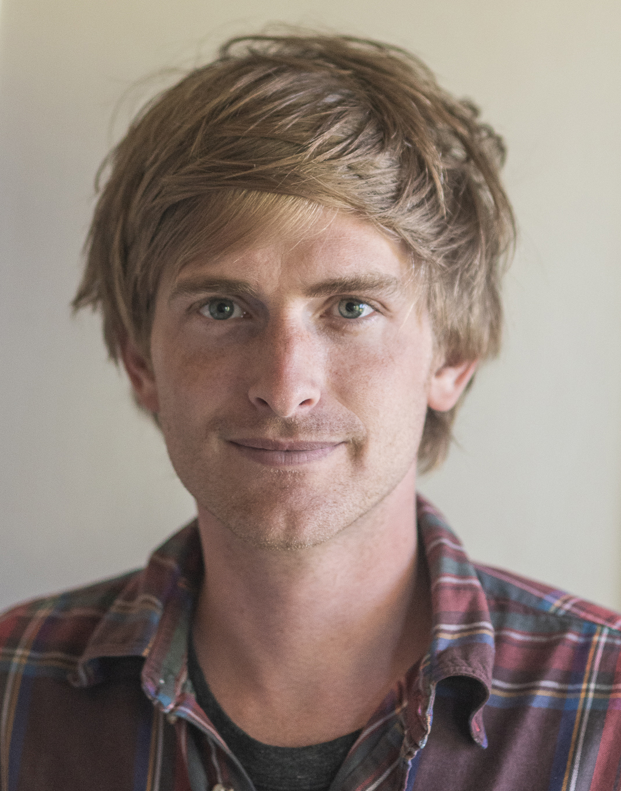
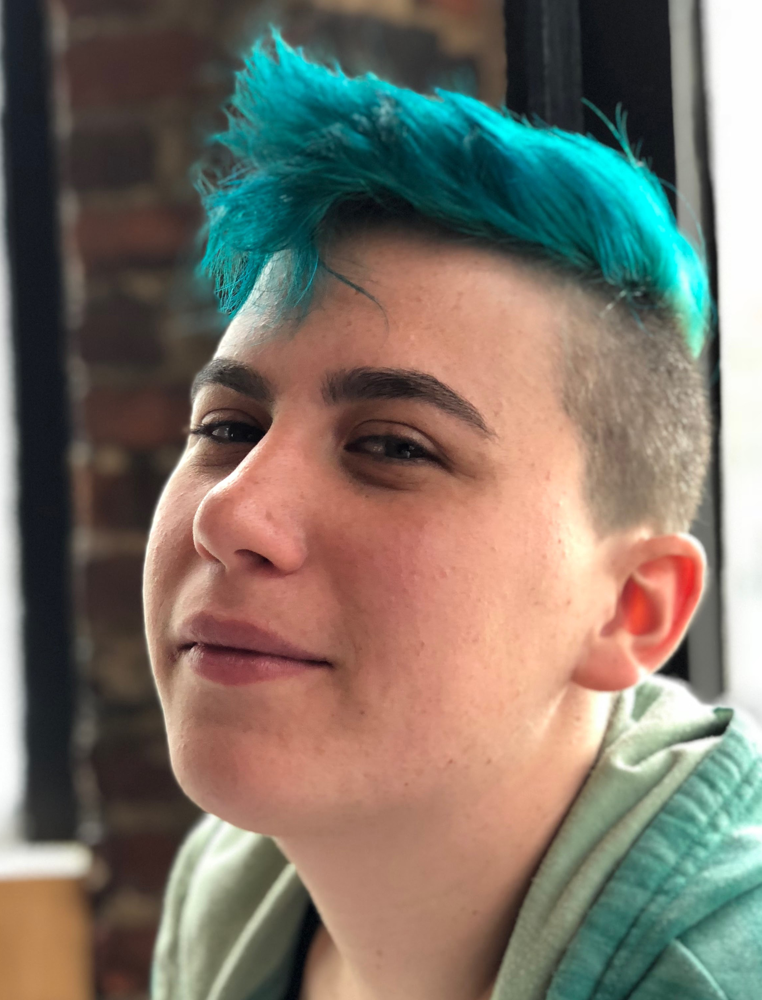
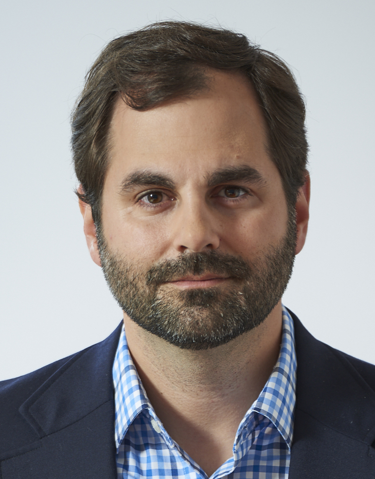
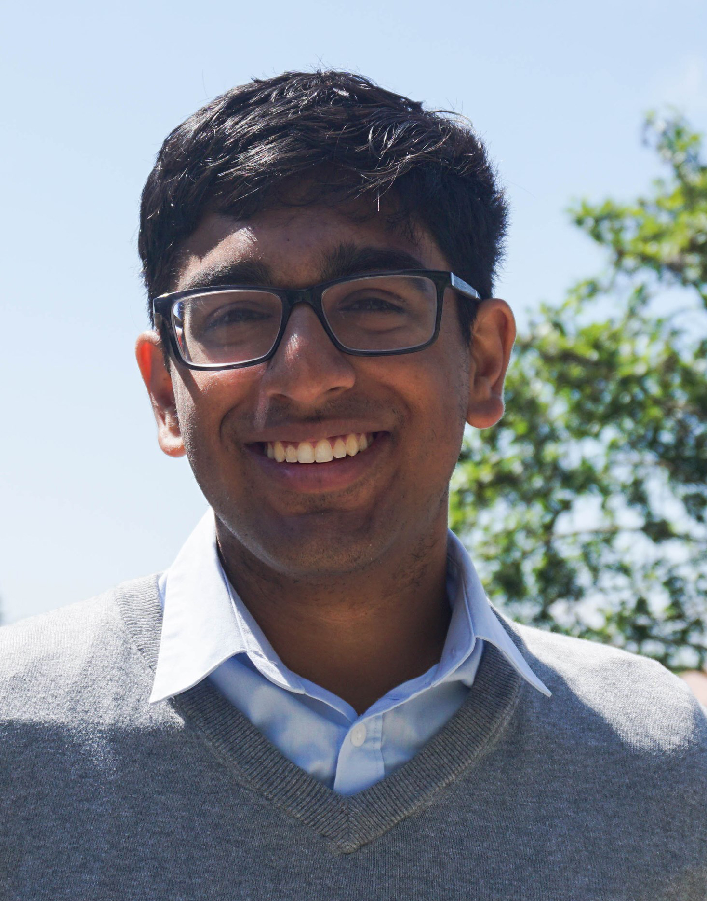
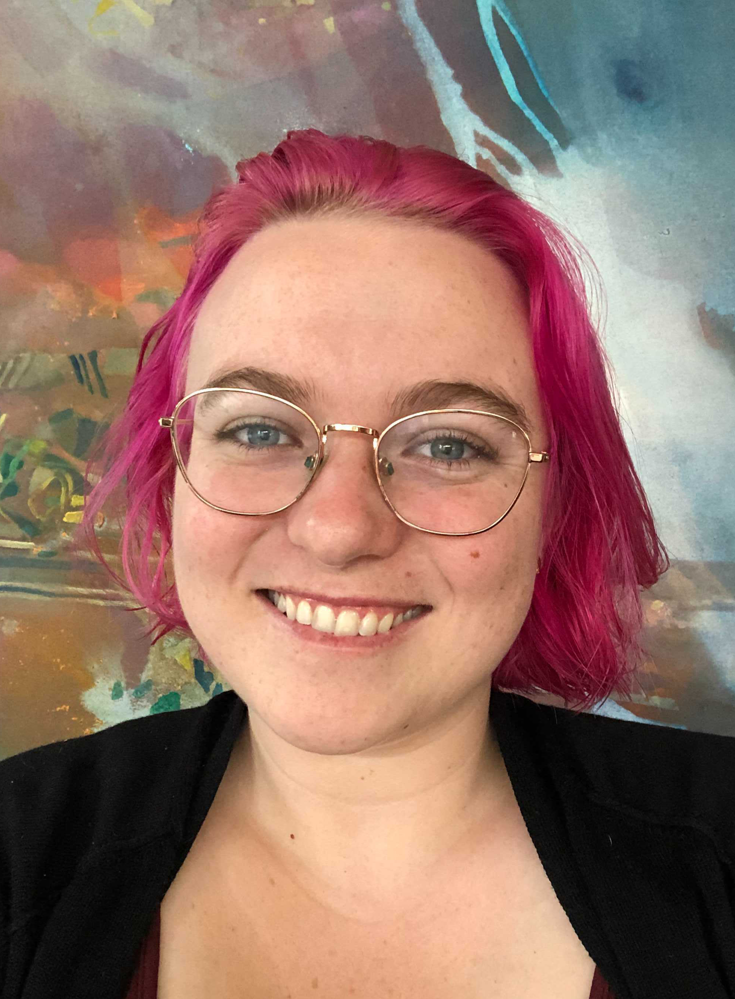
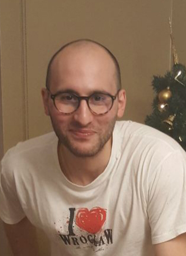
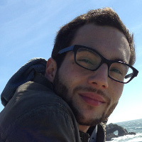
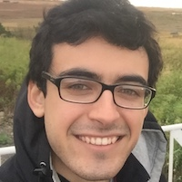

The `childes-db` project aims to make [CHILDES](https://childes.talkbank.org)
transcripts more accessible by reducing the amount of preprocessing (e.g.,
CLAN or specific preprocessing libraries) and by making the individual tokens,
utterances, transcripts, and corpora available in a tidy, tabular format that
is accessible across programming languages. We release new versions of this
dataset periodically to facilitate reproducibility. We also provide an R
package ([childesr](https://langcog.github.io/childesr/)) and a Python package
([childespy](https://pypi.org/project/childespy/)) which allow users to access
this database without having to write complex SQL queries.

## Citation policy

If you use `childes-db` to access CHILDES in your research, please note the
database version you used (e.g., `2021.1`) and cite:

1. The `childes-db` paper in *Behavior Research Methods*:

   > \*Sanchez, A., \*Meylan, S. C., Braginsky, M., MacDonald, K. E.,
   > Yurovsky, D., & Frank, M. C. (2019). childes-db: A flexible and
   > reproducible interface to the Child Language Data Exchange System.
   > *Behavior Research Methods, 51*(4), 1928–1941.
   > (\* indicates co-first authorship)

2. CHILDES itself — both the database and the corpora you use — following the
   [TalkBank policy](https://talkbank.org/share/citation.html).

## Meet the childes-db team

::: {.team-grid}

[**Stephan Meylan**](https://stephanmeylan.com/)
MIT & Duke University

[**Mika Braginsky**](https://mikabr.github.io)
MIT

[**Michael C. Frank**](https://web.stanford.edu/~mcfrank)
Stanford University

[**Sathvik Nair**](https://sathvikn.github.io)
UC Berkeley (now at Amazon)

**Jess Mankewitz**
Stanford University

**Sarp Uner**
Duke University

[**Daniel Yurovsky**](https://www.danyurovsky.com)
Carnegie Mellon University

[**Kyle MacDonald**](https://kemacdonald.github.io/)
UCLA

:::

## childes-db alumni

::: {.team-grid}

[**Alessandro Sanchez**](https://github.com/amsan7)
Stanford University

:::
