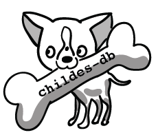
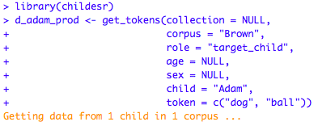
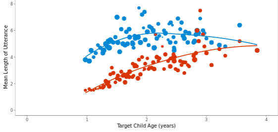

```{=html}
<div class="cdb-hero">
  
  <div class="cdb-hero-title">
    <div class="cdb-title">childes-db</div>
    <p>A flexible and reproducible interface to CHILDES</p>
  </div>
  <div class="cdb-hero-logos">
    <a href="https://childes.talkbank.org" target="_blank">
      
    </a>
  </div>
</div>
```

```{ojs index-stats}
//| output: false
site_stats = FileAttachment("data/stats.json").json()
```

```{ojs index-lead}
html`<div class="cdb-lead" style="text-align:center">childes-db ${site_stats.version} contains
${site_stats.n_transcripts.toLocaleString()} transcripts of speech to and from
${site_stats.n_children.toLocaleString()} children, across
${site_stats.n_corpora} corpora in ${site_stats.n_collections} collections.</div>`
```

```{=html}
<div class="cdb-big-cards">
  <a href="https://langcog.github.io/childesr/">
    <div class="cdb-card-title">API Tutorial</div>
    <p>Get a hands-on walk-through on accessing <code>childes-db</code>
       through R.</p>
    
  </a>
  <a href="frequency.html">
    <div class="cdb-card-title">Visualizations</div>
    <p>Explore the data in <code>childes-db</code> using our interactive
       applications.</p>
    
  </a>
</div>
```

The `childes-db` project is an open database storing child language datasets
from [CHILDES](https://childes.talkbank.org) in a well-documented, easily
accessible, tabular format. It also provides a versioning system for corpora
and tools to facilitate reproducible research with child language corpora.
Researchers can interface with CHILDES through the interactive visualizations
on this site, the [childesr](https://langcog.github.io/childesr/) R package,
the [childespy](https://pypi.org/project/childespy/) Python package, or
directly through SQL.

For a complete overview along with examples, refer to
[our paper](https://link.springer.com/article/10.3758/s13428-018-1176-7) in
*Behavior Research Methods*:

> \*Sanchez, A., \*Meylan, S. C., Braginsky, M., MacDonald, K. E., Yurovsky,
> D., & Frank, M. C. (2019). childes-db: A flexible and reproducible interface
> to the Child Language Data Exchange System. *Behavior Research Methods, 51*(4),
> 1928–1941. (\* indicates co-first authorship)

```{=html}
<div class="cdb-release-bar">
  <h3>New in 2026.1
    <span class="cdb-release-badge">release candidate — coming soon</span></h3>
  <ul>
    <li><strong>More data:</strong> 24.2 million utterances (+24%) and 89
      million tokens, including ~73 corpora new to childes-db.</li>
    <li><strong>New annotation tiers:</strong> Universal Dependencies
      morphology (with a morpheme-level table) and dependency parses, Japanese
      romanization, speech acts, and phonology.</li>
    <li><strong>Redivis-hosted, versioned data:</strong> every release
      browsable, queryable, and downloadable on
      <a href="data.html">Redivis</a>.</li>
    <li><strong>Corrected child identities:</strong> target-child identities
      corrected across corpora (Day corrections).</li>
  </ul>
</div>
```
